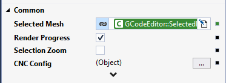

## TcHmiCncControls
### TwinCAT HMI CNC Controls

The intent of this package is to provide framework controls for use with CNC applications on the Beckhoff TwinCAT HMI platform.

### Controls

#### [GCode Editor](/TcHmiCncControls/GCodeEditor/)

A simple utilization of the [ace editor](https://github.com/ajaxorg/ace) configured for GCode and wrapped in a TwinCAT HMI framework control. It provides basic editor functions, syntax highlighting, search & replace, etc.

#### [GCode Path Renderer](/TcHmiCncControls/GCodePathRenderer/)

A GCode parser and interpreter, along with a 3D rendering environment using the [BabylonJS](https://github.com/BabylonJS/Babylon.js) engine. This control is intended to provide a 3D tool path visualization of the supplied GCode string.

#### Version Info
The framework project has recently been ported to TwinCAT HMI 1.14. To open it in 1.12, simply change the following like in the `TcHmiCncControls\TcHmiCncControls.hmiextproj` file:
```
<HmiRecent>14.1.345.1</HmiRecent>
```
to
```
<HmiRecent>1.12.760.59</HmiRecent>
```

### Quick Start

1. Add reference (Either as a [package](/release/) or as a project reference)

2. Drop controls on page
3. Call the `SetPath` method of the Renderer with the Editor's `Content` property as input


The control is also able to render the path progress based on the selected line in the editor. It also supports click events on the rendering itself to take you to the GCode line in the editor:
1. Enable the `Render Progress` property of the Renderer

2. Bind the Renderer's `Selected Mesh` property to the Editor's `Selected Line` property
3. Bind the Editor's `Selected Line` property to the Renderer's `Selected Mesh` property


### [License](/TcHmiCncControls/LICENSE.txt)
