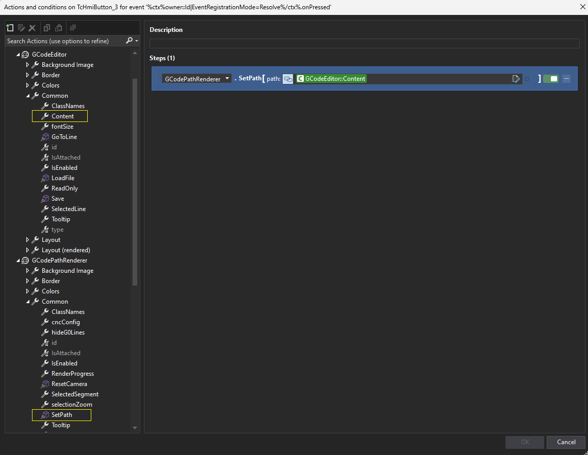

## TcHmiCncControls
### TwinCAT HMI CNC Controls

The intent of this package is to provide framework controls for use with CNC applications on the Beckhoff TwinCAT HMI platform.

### Controls

#### [GCode Editor](/TcHmiCncControls/GCodeEditor/)

A simple utilization of the [ace editor](https://github.com/ajaxorg/ace) configured for GCode and wrapped in a TwinCAT HMI framework control. It provides basic editor functions, syntax highlighting, search & replace, etc.

#### [GCode Path Renderer](/TcHmiCncControls/GCodePathRenderer/)

A GCode parser and interpreter, along with a 3D rendering environment using the [BabylonJS](https://github.com/BabylonJS/Babylon.js) engine. This control is intended to provide a 3D tool path visualization of the supplied GCode string.

#### Version Info
The master branch will be for TwinCAT HMI version 14.n (currently 14.3). We will maintain a separate branch for users of 1.12.

### Quick Start

1. Add reference (Either as a [package](/release/) or as a project reference):

2. Drop controls on a page
3. Call the `SetPath` method of the Renderer with the Editor's `Content` property as input:

The control is also able to render the path progress based on the selected line in the editor. It also supports click events on the rendering itself to take you to the GCode line in the editor.

1. Enable the `Render Progress` property of the Renderer, and bind the Renderer's `Selected Segment` property to the Editor's `Selected Line` property:

3. Bind the Editor's `Selected Line` property to the Renderer's `Selected Segment` property to enable clicking on the rendering to jump to the associated GCode line in the editor:

---
### Demo:

### Changelog

### 0.1.0
- Changed some renderer property names; most notably `Selected Mesh` to `Selected Segment`
- Added tool path rendering:
  - Use the `Tooling Config` property to specify a model file ([supported types](https://doc.babylonjs.com/features/featuresDeepDive/importers/loadingFileTypes)). Apply position, rotation, and scaling offsets. Enable the `Track Tool Path` sub-property
  - Use the `Tooling Dynamics` property to bind real-time position and rotation data from the controller
  - Enable tool path tracking to trace the path of the tooling as it moves
  - Use the renderer's `ClearToolPath()` method to clear tool path traces
  - Specify trace color with the `Tool Path Line Color` property

---

### Future

- Port to TypeScript 😬
  - Use ES modules maybe? Would break 1.12 compatability...
- More options around tool tracing
- Fix/refine camera tool following

### [License](/TcHmiCncControls/LICENSE.txt)
